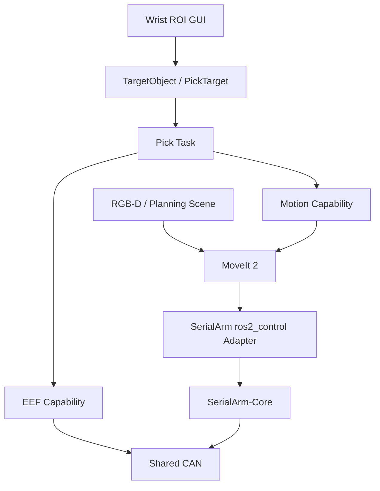

<div align="center">

# Tomato-Picker-ROS2

ROS 2 Humble + MoveIt 2 + SerialArm-Core tomato picking application stack

面向自研机械臂的末端执行器、RGB-D 感知、运动能力与采摘任务编排

[](LICENSE)
[](https://docs.ros.org/en/humble/)
[](https://moveit.picknik.ai/humble/)
[](https://github.com/Kaede-Rei/SerialArm-Core)

</div>

## 项目简介

Tomato-Picker-ROS2 是构建在 [SerialArm-Core](https://github.com/Kaede-Rei/SerialArm-Core) 之上的番茄采摘应用层

SerialArm-Core 负责机械臂模型、控制、安全、Hardware Backend、Robot Profile、ros2_control 与 MoveIt 2；Tomato-Picker 不重复实现机械臂底层

Tomato-Picker 负责：

- EEF 末端执行器
- MoveIt 2 运动能力封装
- RGB-D / Planning Scene 感知
- 单目标采摘阶段机
- 可选腕部 RGB-D 人工框选 GUI
- 整机部署入口

## 架构



```text
SerialArm-Core
    Robot / Control / Safety / Hardware / Profile / ros2_control / MoveIt

Tomato-Picker
    interfaces / motion / eef / perception / task / gui / bringup
```

## 当前能力

| 能力 | 入口 |
| --- | --- |
| 机械臂整机 + MoveIt 2 | SerialArm-Core `moveit.launch.py` |
| HOME / JOINT / POSE / LINE | `/tomato_picker/motion/move_arm` |
| EEF OPEN / CLOSE / STOP / SET_POSITION | `/tomato_picker/eef/command` |
| EEF 就绪状态 | `/tomato_picker/eef/ready` |
| 单目标采摘 | `/tomato_picker/task/pick` |
| Planning Scene 开关 | `/tomato_picker/perception/set_scene_enabled` |
| GUI 框选目标 | `/tomato_picker/gui/selected_target` |

## 仓库结构

```text
Tomato-Picker-ROS2/
├── repos/
│   └── serial_arm.repos
├── src/tomato_picker/
│   ├── interfaces/    # ROS contracts
│   ├── motion/        # MoveIt capability
│   ├── eef/           # Picking tool capability
│   ├── perception/    # RGB-D / Planning Scene
│   ├── task/          # Pick behavior
│   ├── gui/           # Optional wrist ROI GUI
│   └── bringup/       # Deployment assembly
├── API.md
└── README.md
```

## Quick Start

### 1. 获取 SerialArm-Core

当前工作区固定使用 **SerialArm-Core `v0.5.1`**；在仓库根目录：

```bash
source /opt/ros/humble/setup.bash
vcs import src < repos/serial_arm.repos
```

如果 workspace 已存在旧 Core：

```bash
rm -rf src/SerialArm-Core
vcs import src < repos/serial_arm.repos
```

### 2. 安装依赖并编译

从已有 workspace 更新接口后，建议先清理生成物：

```bash
rm -rf build install log
```

然后：

```bash
rosdep install \
  --from-paths src \
  --ignore-src \
  -r -y \
  --rosdistro humble

colcon build --symlink-install
source install/setup.bash
```

### 3. 一键启动整机

```bash
ros2 launch tomato_picker_bringup bringup.launch.py
```

启动顺序：

```text
SerialArm hardware / controllers / MoveIt
    ↓ READY + stable
EEF homing
    ↓ READY
Motion
    ↓ Action READY
Task / Perception / optional GUI
```

ARM 的 Robot Profile、阻抗模式、停车逻辑与 ros2_control 生命周期全部由 SerialArm-Core 管理

主要参数：

| 参数 | 默认值 | 说明 |
| --- | --- | --- |
| `robot_profile` | `dm_arm_gray` | SerialArm Robot Profile |
| `serial_port` | `/dev/ttyACM0` | 可选运行时串口覆盖，例如 `/dev/ttyACM1` |
| `baudrate` | `921600` | 可选运行时波特率覆盖 |
| `bus` | `main_can` | 可选共享 bus name 覆盖 |
| `eef_mode` | `damiao` | `damiao` / `mock` / `off` |
| `start_perception` | `true` | RGB-D Planning Scene |
| `start_wrist_camera` | `false` | 启动 Orbbec Gemini 330 系列驱动 |
| `start_gui` | `false` | 启动腕部相机框选 GUI |
| `use_sim_time` | `false` | ROS simulation time |

> serial_port / baudrate / bus 默认值为 SerialArm-Core 的 Robot Profile 配置

SerialArm runtime hardware override 会同时作用到 EEF 的共享 CAN 配置，避免 ARM 与 EEF 使用不同串口或 bus

例如机械臂枚举到 `/dev/ttyACM1`：

```bash
ros2 launch tomato_picker_bringup bringup.launch.py \
  serial_port:=/dev/ttyACM1 \
  start_perception:=false
```

### 4. 检查系统

```bash
ros2 control list_controllers
ros2 action list | grep tomato_picker
ros2 service list | grep tomato_picker
```

真机模式应看到：

```text
joint_state_broadcaster       active
joint_trajectory_controller   active
eef_controller                active
```

EEF：

```bash
ros2 service call \
  /tomato_picker/eef/ready \
  std_srvs/srv/Trigger \
  "{}"
```

应返回：

```text
success: true
message: READY
```

## 手眼标定专用 Bringup

手眼标定不要启动整机 `bringup.launch.py`；专用入口只启动 `RobotSession` bridge，由它独占机械臂 Hardware Backend，并直接发布 SerialArm-Core 已计算的末端位姿：

```bash
ros2 launch tomato_picker_bringup handeye.launch.py
```

默认：

```text
robot_profile = dm_arm_gray
pose_topic    = /arm/pose
publish_rate  = 30 Hz
start mode    = COMPLIANT_DRAG
```

可覆盖硬件连接：

```bash
ros2 launch tomato_picker_bringup handeye.launch.py \
  robot_profile:=dm_arm_gray \
  serial_port:=/dev/ttyACM0 \
  baudrate:=921600 \
  bus:=main_can
```

此入口不会启动 MoveIt、ros2_control、EEF、Task、Perception、GUI 或相机驱动，避免多个节点同时占用机械臂硬件

Handeye-Calibration-App 使用：

```text
ROS2 input type = Pose
input topic     = /arm/pose
message         = geometry_msgs/msg/PoseStamped
```

发布规则：

```text
RobotState == ACTIVE
AND snapshot.valid == true
AND snapshot.last_error is empty
        ↓
发布 /arm/pose
```

因此 FAULT 期间以及 `clear_fault()` 后第一个新有效控制周期到来之前都不会发布旧位姿

### FAULT 在线恢复

SerialArm-Core `v0.5.1` 在可恢复 `FAULT + fault_holding` 下会保持 worker 存活并持续维护 fault hold；bridge 提供：

```text
/handeye/fault/clear               std_srvs/srv/Trigger
/handeye/fault/compliant_recovery  std_srvs/srv/Trigger
/handeye/fault/rigid_hold           std_srvs/srv/Trigger
/handeye/drag/enable                std_srvs/srv/Trigger
```

普通瞬态可恢复 FAULT，例如偶发 `INVALID_DT`，推荐流程：

```text
COMPLIANT_DRAG
    ↓
FAULT + RIGID_HOLD
    ↓
等待 fault hold 稳定
    ↓
/handeye/fault/clear
    ↓
ACTIVE + RIGID_HOLD
    ↓
等待新的 valid snapshot
    ↓
/handeye/drag/enable
    ↓
COMPLIANT_DRAG
```

命令：

```bash
ros2 service call /handeye/fault/clear std_srvs/srv/Trigger "{}"
ros2 service call /handeye/drag/enable std_srvs/srv/Trigger "{}"
```

`clear_fault()` **不会自动重新进入拖拽模式**；这是安全设计：清故障后先保持 `ACTIVE + RIGID_HOLD`，必须由操作员在确认机械臂和新位姿正常后显式调用 `/handeye/drag/enable`

只有在需要人工把机械臂拖离 Core 允许的危险构型时才使用 FAULT compliant recovery：

```bash
ros2 service call /handeye/fault/compliant_recovery std_srvs/srv/Trigger "{}"
ros2 service call /handeye/fault/rigid_hold std_srvs/srv/Trigger "{}"
ros2 service call /handeye/fault/clear std_srvs/srv/Trigger "{}"
```

是否允许进入 compliant recovery 仍完全由 SerialArm-Core Safety 判定，Tomato-Picker 不绕过 Safety

如果 Core 无法建立/维持 fault hold，worker 会停止，此时不要继续标定，应检查通信、电机和硬件状态后重新启动

## 采摘阶段

默认阶段机：

```text
PRE_PICK
↓
APPROACH
↓
PICK
↓
EEF_CLOSE
↓
RETREAT
↓
PLACE       optional
↓
EEF_OPEN    optional
↓
HOME        optional
```

`pre_pick_pose`、`approach_pose` 与 `retreat_pose` 都可以显式指定

未显式指定时，Task 会沿最终采摘位姿的 **局部 TCP Z 轴** 自动生成：

```text
pre_pick_distance = 0.15 m
approach_distance = 0.08 m
retreat_distance  = 0.10 m
```

详细字段与阶段反馈见 [API.md](API.md)

## 常用请求

### MoveArm HOME

首次真机测试建议先只规划：

```bash
ros2 action send_goal \
  /tomato_picker/motion/move_arm \
  tomato_picker_interfaces/action/MoveArm \
  "{command_type: 0, velocity_scale: 0.1, acceleration_scale: 0.1, execute: false}" \
  --feedback
```

### EEF

```bash
# OPEN
ros2 service call \
  /tomato_picker/eef/command \
  tomato_picker_interfaces/srv/CommandEef \
  "{command: 0, value: 0.0}"

# SET_POSITION, normalized [0, 1] -> TODO:新夹爪应修正为 [0, 0.91]
ros2 service call \
  /tomato_picker/eef/command \
  tomato_picker_interfaces/srv/CommandEef \
  "{command: 3, value: 0.25}"
```

### PickTarget

目标位姿必须替换为已经验证的安全值：

```bash
ros2 action send_goal \
  /tomato_picker/task/pick \
  tomato_picker_interfaces/action/PickTarget \
  "{target_pose: {header: {frame_id: base_link}, pose: {position: {x: 0.40, y: 0.0, z: 0.40}, orientation: {w: 1.0}}}, pre_pick_distance: 0.15, approach_distance: 0.08, retreat_distance: 0.10, use_eef: true, go_home_after_finish: false}" \
  --feedback
```

完整 Service / Action Reference 见 [API.md](API.md)

## 腕部相机与框选 GUI

GUI 是暂未接入视觉模型时的人工目标入口，仅保留一台腕部 RGB-D 相机

### Gemini 335L

可选安装官方 Orbbec ROS 2 driver：

```bash
sudo apt install ros-humble-orbbec-camera ros-humble-orbbec-description
```

使用一个 bringup 同时启动相机与 GUI：

```bash
python3 -m pip install PySide6

ros2 launch tomato_picker_bringup bringup.launch.py \
  start_wrist_camera:=true \
  start_gui:=true \
  start_perception:=false
```

默认相机 topics：

```text
/camera/wrist/color/image_raw
/camera/wrist/depth/image_raw
/camera/wrist/depth/camera_info
```

GUI 要求 depth 已对齐到 color；`start_wrist_camera:=true` 会以 `depth_registration:=true` 启动 Gemini 330 系列 driver

如果当前 Orbbec TF tree 的 `camera_link` 尚未连接到机械臂 URDF 中的 `camera` frame，并且两者已经确认使用同一物理原点，可额外启用：

```bash
publish_wrist_camera_mount_tf:=true
```

已有手眼标定 TF 时不要重复发布该默认连接

### GUI 操作

1. 左键在腕部 RGB 图像上依次添加多边形 ROI 顶点
2. 右键或 `清除 ROI` 清空当前选择
3. `确认框选目标`：ROI → 稳健深度 → 3D 反投影 → TF 到 `base_link`
4. 目标发布到 `/tomato_picker/gui/selected_target`
5. GUI 可直接发送 `/tomato_picker/task/pick`

当前 GUI 只从 ROI 获取目标 **位置**；目标姿态沿用框选时 `tool0` 的当前姿态，不做视觉姿态识别

后续接入检测 / 分割模型时，只需要替换目标产生方式，不需要修改 Motion / EEF / PickTask 接口

## 配置

| 模块 | 配置文件 |
| --- | --- |
| EEF | `src/tomato_picker/eef/config/damiao_eef.yaml` |
| Motion | `src/tomato_picker/motion/config/motion.yaml` |
| Perception | `src/tomato_picker/perception/config/perception.yaml` |
| Pick Task | `src/tomato_picker/task/config/task.yaml` |
| Wrist GUI | `src/tomato_picker/gui/config/gui.yaml` |

机械臂 Core、Hardware、URDF、Controllers、MoveIt 与阻抗模式由 SerialArm Robot Profile 管理，不在 Tomato-Picker 重复配置

## 文档

- [API.md](API.md)：Service / Action / Message API Reference
- [SerialArm-Core](https://github.com/Kaede-Rei/SerialArm-Core)：机械臂平台层
- [Tomato-Picker-PiPER](https://github.com/Kaede-Rei/Tomato-Picker-PiPER)：旧 ROS 1 实验系统，仅作为历史设计参考

## License

以仓库当前 [LICENSE](LICENSE) 为准
